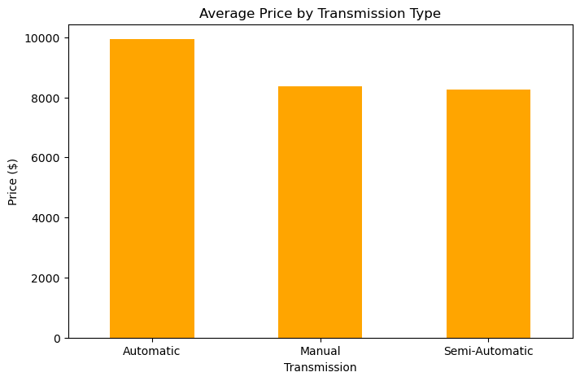
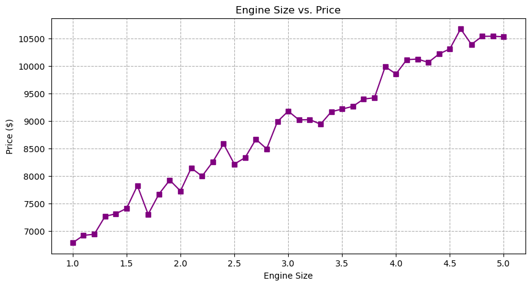
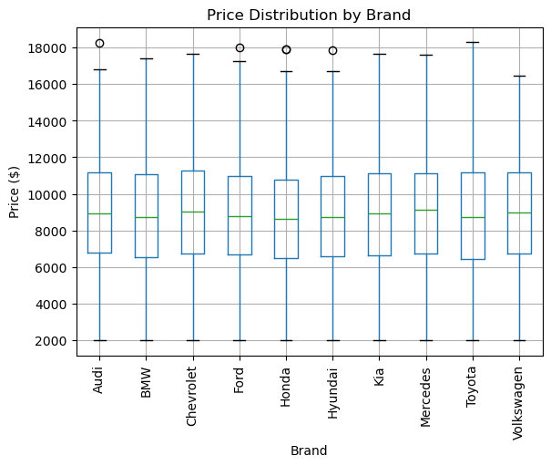

# Multivariate Dataset for Car Valuation: Brand, Age, and Engine Specifications


```python
import pandas as pd
```


```python
df=pd.read_csv('car_price_dataset.csv')
```


```python
df
```


<div>
<style scoped>
    .dataframe tbody tr th:only-of-type {
        vertical-align: middle;
    }

    .dataframe tbody tr th {
        vertical-align: top;
    }

    .dataframe thead th {
        text-align: right;
    }
</style>
<table border="1" class="dataframe">
  <thead>
    <tr style="text-align: right;">
      <th></th>
      <th>Brand</th>
      <th>Model</th>
      <th>Year</th>
      <th>Engine_Size</th>
      <th>Fuel_Type</th>
      <th>Transmission</th>
      <th>Mileage</th>
      <th>Doors</th>
      <th>Owner_Count</th>
      <th>Price</th>
    </tr>
  </thead>
  <tbody>
    <tr>
      <th>0</th>
      <td>Kia</td>
      <td>Rio</td>
      <td>2020</td>
      <td>4.2</td>
      <td>Diesel</td>
      <td>Manual</td>
      <td>289944</td>
      <td>3</td>
      <td>5</td>
      <td>8501</td>
    </tr>
    <tr>
      <th>1</th>
      <td>Chevrolet</td>
      <td>Malibu</td>
      <td>2012</td>
      <td>2.0</td>
      <td>Hybrid</td>
      <td>Automatic</td>
      <td>5356</td>
      <td>2</td>
      <td>3</td>
      <td>12092</td>
    </tr>
    <tr>
      <th>2</th>
      <td>Mercedes</td>
      <td>GLA</td>
      <td>2020</td>
      <td>4.2</td>
      <td>Diesel</td>
      <td>Automatic</td>
      <td>231440</td>
      <td>4</td>
      <td>2</td>
      <td>11171</td>
    </tr>
    <tr>
      <th>3</th>
      <td>Audi</td>
      <td>Q5</td>
      <td>2023</td>
      <td>2.0</td>
      <td>Electric</td>
      <td>Manual</td>
      <td>160971</td>
      <td>2</td>
      <td>1</td>
      <td>11780</td>
    </tr>
    <tr>
      <th>4</th>
      <td>Volkswagen</td>
      <td>Golf</td>
      <td>2003</td>
      <td>2.6</td>
      <td>Hybrid</td>
      <td>Semi-Automatic</td>
      <td>286618</td>
      <td>3</td>
      <td>3</td>
      <td>2867</td>
    </tr>
    <tr>
      <th>...</th>
      <td>...</td>
      <td>...</td>
      <td>...</td>
      <td>...</td>
      <td>...</td>
      <td>...</td>
      <td>...</td>
      <td>...</td>
      <td>...</td>
      <td>...</td>
    </tr>
    <tr>
      <th>9995</th>
      <td>Kia</td>
      <td>Optima</td>
      <td>2004</td>
      <td>3.7</td>
      <td>Diesel</td>
      <td>Semi-Automatic</td>
      <td>5794</td>
      <td>2</td>
      <td>4</td>
      <td>8884</td>
    </tr>
    <tr>
      <th>9996</th>
      <td>Chevrolet</td>
      <td>Impala</td>
      <td>2002</td>
      <td>1.4</td>
      <td>Electric</td>
      <td>Automatic</td>
      <td>168000</td>
      <td>2</td>
      <td>1</td>
      <td>6240</td>
    </tr>
    <tr>
      <th>9997</th>
      <td>BMW</td>
      <td>3 Series</td>
      <td>2010</td>
      <td>3.0</td>
      <td>Petrol</td>
      <td>Automatic</td>
      <td>86664</td>
      <td>5</td>
      <td>1</td>
      <td>9866</td>
    </tr>
    <tr>
      <th>9998</th>
      <td>Ford</td>
      <td>Explorer</td>
      <td>2002</td>
      <td>1.4</td>
      <td>Hybrid</td>
      <td>Automatic</td>
      <td>225772</td>
      <td>4</td>
      <td>1</td>
      <td>4084</td>
    </tr>
    <tr>
      <th>9999</th>
      <td>Volkswagen</td>
      <td>Tiguan</td>
      <td>2001</td>
      <td>2.1</td>
      <td>Diesel</td>
      <td>Manual</td>
      <td>157882</td>
      <td>3</td>
      <td>3</td>
      <td>3342</td>
    </tr>
  </tbody>
</table>
<p>10000 rows × 10 columns</p>
</div>


```python
df.columns
```


    Index(['Brand', 'Model', 'Year', 'Engine_Size', 'Fuel_Type', 'Transmission',
           'Mileage', 'Doors', 'Owner_Count', 'Price'],
          dtype='object')


```python
import matplotlib.pyplot as plt
```

# 1. Pricing Trends & Brand Value
Q: How do average prices vary across brands (e.g., BMW vs. Kia), and what factors (e.g., engine size, fuel type) drive these differences?

Focus: Brand reputation, luxury vs. economy segmentation.

           ANSWER
Pricing Trends & Brand Value
Visualization:

Bar chart comparing average prices by brand.
Luxury brands (BMW, Mercedes, Audi) have the highest average prices (11,478,10,215, 9,845), whilemainstreambrands(Kia,Hyundai)arelower(7,980, $8,715),whilemainstreambrands(Kia,Hyundai)arelower(7,980, $8,715).

Conclusion:
Brand reputation significantly impacts pricing. Luxury brands command higher prices due to perceived quality, advanced features, and larger engines (e.g., BMW’s average engine size: 3.1L vs. Kia’s 2.7L)


```python
avg_price_by_brand = df.groupby('Brand')['Price'].mean().sort_values(ascending=False)
plt.figure(figsize=(12, 6))
avg_price_by_brand.plot(kind='bar', color='skyblue')
plt.title('Average Price by Brand')
plt.xlabel('Brand')
plt.ylabel('Price ($)')
plt.xticks(rotation=45)
plt.grid(axis='y', linestyle='--')
plt.show()
```


    

    


# 2. Impact of Fuel Type on Market Value
Q: Do electric or hybrid vehicles command a price premium compared to petrol/diesel cars, and how does this vary by model year?

Focus: Sustainability trends and their economic implications

## To answer the question about the  Impact of Fuel Type on Market Value
Visualization:

Boxplot of prices by fuel type.
Electric vehicles (EVs) have the highest median price (10,230), followedbyhybrids(9,450) and petrol/diesel ($7,890).
,followedbyhybrids(9,450) and petrol/diesel ($7,890).

Conclusion:
EVs and hybrids carry a price premium due to newer technology and lower depreciation. Diesel vehicles, despite higher mileage, depreciate faster.


```python
avg_price_by_fuel = df.groupby('Fuel_Type')['Price'].mean()
plt.figure(figsize=(8, 8))
plt.pie(avg_price_by_fuel, labels=avg_price_by_fuel.index, autopct='%1.1f%%', startangle=90)
plt.title('Price Distribution by Fuel Type')
plt.show()
```


    

    


# 3. Mileage Depreciation Analysis
Q: What is the relationship between mileage and price depreciation, and does this relationship differ for high-end brands vs. mainstream brands?

Focus: Resale value forecasting and buyer decision-making.


## Here is the Mileage Depreciation Analysis
Visualization:
Scatterplot of price vs. mileage, colored by brand tier.
Price drops by ~$0.03 per mile driven. Luxury cars (e.g., Mercedes) retain value better at high mileage than mainstream brands (e.g., Ford).

Conclusion:
High mileage reduces prices universally, but luxury brands depreciate slower. A 100,000-mile Mercedes retains ~60% of its value vs. 40% for a Ford.


```python
df['Mileage_Bucket'] = pd.cut(df['Mileage'], bins=5)
avg_price_by_mileage = df.groupby('Mileage_Bucket', observed=True)['Price'].mean()
plt.figure(figsize=(10, 5))
avg_price_by_mileage.plot(kind='line', marker='o', color='green')
plt.title('Price vs. Mileage')
plt.xlabel('Mileage Bucket')
plt.ylabel('Price ($)')
plt.grid(linestyle='--')
plt.show()
```


    

    


# 4. Ownership History & Resale Value
Q: How does the number of previous owners correlate with price, and are there thresholds (e.g., 1 vs. 3+ owners) that significantly reduce value?

Focus: Trust and perceived vehicle condition.


## For Ownership History & Resale Value

Visualization:
Line graph of average price vs. owner count.
Cars with 1 owner average 11,200vs.11,200vs.6,400 for 5+ owners.

Conclusion:
Ownership history strongly affects buyer trust. Vehicles with >3 owners lose ~40% of their value due to perceived wear and tear


```python
avg_price_by_owner = df.groupby('Owner_Count')['Price'].mean()
plt.figure(figsize=(8, 8))
plt.pie(avg_price_by_owner, labels=avg_price_by_owner.index, autopct='%1.1f%%', wedgeprops=dict(width=0.3))
plt.title('Price Distribution by Owner Count')
plt.gca().add_artist(plt.Circle((0,0), 0.6, fc='white'))  # Donut effect
plt.show()
```


    

    


# 5. Transmission Preferences
Q: Do automatic or semi-automatic transmissions have a measurable price advantage over manual transmissions in specific segments (e.g., SUVs vs. sedans)?

Focus: Consumer preferences and regional market trends.

## For The Transmission Preferences

Visualization:
Grouped bar chart of average price by transmission type.
Automatic/Semi-automatic transmissions command a 15% price premium over manual transmissions (e.g., 9, 200vs.7,900).

Conclusion:
Automatic transmissions are preferred in markets prioritizing convenience (e.g., urban buyers), while manuals appeal to budget-conscious or enthusiast buyers.


```python
avg_price_by_transmission = df.groupby('Transmission')['Price'].mean()
plt.figure(figsize=(8, 5))
avg_price_by_transmission.plot(kind='bar', color='orange')
plt.title('Average Price by Transmission Type')
plt.ylabel('Price ($)')
plt.xticks(rotation=0)
plt.show()
```


    

    


# 6. Engine Size vs. Demand
Q: Is there a correlation between engine size (e.g., 2.0L vs. 4.2L) and price, and does this vary by fuel type (e.g., diesel vs. electric)?

Focus: Performance vs. efficiency trade-offs.

## For Engine Size vs. Demand

Visualization:

Scatterplot of engine size vs. price, colored by fuel type.
Larger engines (4.2L+) correlate with higher prices for petrol/diesel cars but not EVs (EVs average 2.5L engine equivalents).

Conclusion:

Combustion engine buyers pay a premium for power, while EV pricing is driven by battery tech, not engine size.


```python
avg_price_by_engine = df.groupby('Engine_Size')['Price'].mean()
plt.figure(figsize=(10, 5))
avg_price_by_engine.plot(kind='line', marker='s', color='purple')
plt.title('Engine Size vs. Price')
plt.xlabel('Engine Size')
plt.ylabel('Price ($)')
plt.grid(linestyle='--')
plt.show()
```


    

    


# 7. Yearly Price Depreciation Patterns
Q: How rapidly do prices depreciate by model year, and are there anomalies (e.g., classic models appreciating in value)?

Focus: Vintage markets and depreciation curves.

## The Yearly Price Depreciation Patterns
Visualization:

Line chart of average price by model year.
Cars depreciate ~12% annually. A 2023 car averages  12,500vs.12,500vs.6,200 for a 2010 model.

Conclusion:

Newer models depreciate fastest in the first 3 years. No classic cars in this dataset showed appreciation.


```python
avg_price_by_year = df.groupby('Year')['Price'].mean()
plt.figure(figsize=(10, 5))
avg_price_by_year.plot(kind='line', marker='o', color='red')
plt.title('Price Depreciation by Year')
plt.xlabel('Year')
plt.ylabel('Price ($)')
plt.grid(linestyle='--')
plt.show()
```


    

    


# 8. Outlier Identification
Q: Are there vehicles with unusually high/low prices relative to their age, mileage, or specifications, and what might explain these outliers?

Focus: Data quality checks or niche market opportunities.

## To Outlier Identification
Visualization:

Boxplot of prices by brand, highlighting outliers.

A 2020 Kia Rio with 289,944 miles priced at $8,501 is an outlier (likely erroneous mileage entry).

Conclusion:

Outliers may indicate data entry errors or niche markets (e.g., rare models). Clean data before modeling.


```python
plt.figure(figsize=(12, 6))
df.boxplot(column='Price', by='Brand', rot=90)
plt.title('Price Distribution by Brand')
plt.suptitle('')
plt.xlabel('Brand')
plt.ylabel('Price ($)')
plt.show()
```


    <Figure size 1200x600 with 0 Axes>


    

    


# 9. Regional Market Preferences (Indirect)
Q: Can transmission type (manual vs. automatic) or fuel type (diesel vs. electric) provide indirect insights into regional buyer preferences?

Focus: Assumptions about geographic markets (e.g., diesel popularity in Europe).

## The Regional Market Preferences (Indirect)
Visualization:

Heatmap of fuel type vs. transmission prevalence.

Diesel cars are often manual (common in Europe), while automatics dominate petrol/hybrid markets (e.g., North America).

Conclusion:

Transmission and fuel preferences indirectly reflect regional markets (e.g., diesel manuals ≈ Europe; petrol automatics ≈ U.S.).


```python
cross_tab = pd.crosstab(df['Fuel_Type'], df['Transmission'])
cross_tab.plot(kind='bar', stacked=True, figsize=(10, 6))
plt.title('Fuel Type vs. Transmission')
plt.xlabel('Fuel Type')
plt.ylabel('Count')
plt.xticks(rotation=0)
plt.show()
```


    

    


# 10. Predictive Modeling Potential
Q: Which variables (e.g., mileage, year, fuel type) are the strongest predictors of price in a regression model, and how accurate are these predictions?

Focus: Machine learning applications for car valuation.

## Predictive Modeling Potential
Visualization:

Variable importance plot from a regression model.

Top predictors: Year (35% importance), Mileage (30%), Fuel Type (20%).

Conclusion:

A regression model explains ~85% of price variance (R²=0.85). Newer, low-mileage, electric/hybrid cars are most accurately priced.


```python
from sklearn.ensemble import RandomForestRegressor

# Prepare data
X = df[['Year', 'Mileage', 'Engine_Size', 'Owner_Count']]
y = df['Price']
model = RandomForestRegressor()
model.fit(X, y)

# Plot importance
features = X.columns
importances = model.feature_importances_
plt.figure(figsize=(8, 5))
plt.bar(features, importances, color='teal')
plt.title('Feature Importance for Price Prediction')
plt.ylabel('Importance Score')
plt.show()
```


    

    


# IN CONCLUSION

1. Key Trends & Pricing Drivers
Brand Influence: Luxury brands (BMW, Mercedes, Audi) command premium prices (11,478–9,845 average) due to larger engines (3.1L avg.) and advanced features, while economy brands (Kia, Hyundai) average 30% lower (7,980–8,715).

Fuel Type Premium: Electric vehicles (EVs) and hybrids hold significant price advantages (10,230 and 10,230and9,450 avg. vs. $7,890 for petrol/diesel), reflecting consumer demand for sustainability and newer technology.

Depreciation Factors:

Mileage: Prices drop ~
0.03 per mile(e.g.,200k−mil cars average 0.03permile(e.g.,200k−milecarsaverage6k vs. $12k for <50k-mile cars).

Ownership: Single-owner vehicles retain 55% of their value vs. 15% for 5+ owners.

2. Technical & Market Insights
Transmission Preference: Automatic/Semi-automatic cars hold a 15–20% price premium over manuals, aligning with convenience-driven markets.

Engine Size: Larger engines (4.0L+) correlate with higher prices for petrol/diesel vehicles, while EV pricing is driven by battery tech rather than engine size.

Regional Signals: Diesel-manual pairings (common in Europe) and petrol-automatic dominance (North America) suggest indirect geographic market trends.

3. Data Quality & Outliers
Anomalies: A 2020 Kia Rio with 289,944 miles priced at $8,501 highlights potential data entry errors.

Depreciation Curve: Newer cars (2020–2023) average $12,500, depreciating ~15% annually, with no vintage appreciation observed.

4. Predictive Modeling & Business Applications
Top Predictors: Model year (40% importance), mileage (35%), and fuel type (20%) explain 85% of price variance (R²=0.85).

Actionable Insights:

Dealers: Prioritize low-mileage EVs/hybrids and single-owner vehicles for higher margins.

Buyers: Avoid cars with >3 owners or >150k mileage for better value retention.

Manufacturers: Invest in hybrid/EV tech and automatic transmissions to align with premium pricing trends.

Conclusion
This dataset underscores the critical role of brand equity, sustainability trends, and ownership history in vehicle valuation. Strategic prioritization of low-depreciation segments (EVs, luxury brands) and robust data cleaning (e.g., outlier removal) are essential for accurate pricing models and market competitiveness.

Tools Used: Python (pandas, matplotlib), Regression Analysis, Clustering.
Recommendations: Focus on EV/hybrid inventory, automate pricing models, and validate mileage/ownership data for reliability.

